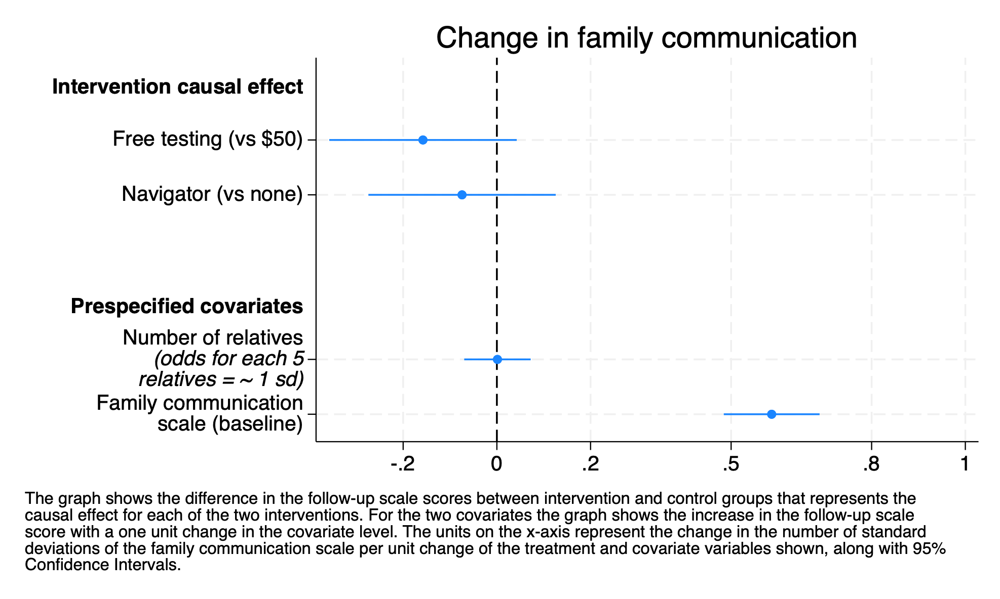

```{r}
#| include: false
stataexe <- "/Applications/StataNow/StataSE.app/Contents/MacOS/stata-se"
knitr::opts_chunk$set(engine.path=list(stata=stataexe))
library(Statamarkdown)
```

The second pre-specified secondary outcome was change in comfort with family communication as measured by a scale administered to index patients enrolled in the study at baseline and after the intervention.

Communication scale described in @sec-fam-comm-scale

##  Communication outcome regresssion

Family communication was assessed at baseline (as described above) and then again at 6 months for the index patients.  

```{stata}
*| eval: true
*| code-fold: true
run sub/load_data.do
run sub/create_vars.do
run sub/add_comm_fu.do
regress i2scale_std_fu i.costarm i.navarm c_relatives i2scale_std ///
	 if id==1
qui est save sub/comm_result, replace
```

There were 262 index patients who responded to the survey.

### Regression results for family communication

```{stata}
*| eval: false
*| code-fold: true
est use sub/comm_result
coefplot, drop(_cons) ///
    xlab( -.2 0 .2 .5 .8 1.0 ) xline(0) ///
    coeflabels(1.costarm = "Free testing (vs $50)" 1.navarm="Navigator (vs none)" /// 
        c_relatives=`"Number of relatives {it:(odds for each 5} {it:relatives = ~ 1 sd)}"' ///
        i2scale_std="Family communication scale (baseline)" ///
    ,wrap(25)) ///
    headings(1.costarm="{bf:Intervention causal effect}" ///
        c_relatives="{bf:Prespecified covariates}") ///
    title("Change in family communication") ///
    note("The graph shows the difference in the follow-up scale scores between intervention and control groups that represents the" ///
		"causal effect for each of the two interventions. For the two covariates the graph shows the increase in the follow-up scale" ///
		"score with a one unit change in the covariate level. The units on the x-axis represent the change in the number of standard" ///
		"deviations of the family communication scale per unit change of the treatment and covariate variables shown, along with 95%" ///
		"Confidence Intervals.",span)
qui graph export "img/comm_results.png",replace
```

### Supplemental Figure 4



* Neither intervention increased comfort with communication at 6 months  
* As expected, the baseline comfort with family communication was a strong predictor of comfort with communication at 6 months which increased 0.59 standard deviations for every 1 standard deviation in the baseline measurment. 
* Family size had no association with comfort with communication at 6 months


```{stata}
*| eval: false
*| code-fold: true
run sub/load_data.do
run sub/create_vars.do
run sub/add_comm_fu.do
estimates use sub/comm_result
estimates esample: i2scale_std_fu costarm navarm c_relatives i2scale_std if id==1

* combined communication result table
collect clear
collect _r_b _r_ci,tags(rowheader["Group means cost"]): margins costarm,at(navarm=0)
collect _r_b _r_ci,tags(rowheader["Difference (cost)"]): margins r.costarm,at(navarm=0)
collect _r_b _r_ci,tags(rowheader["Group means navigator"]): margins navarm,at(costarm=0)
collect _r_b _r_ci,tags(rowheader["Difference (navigator)"]): margins r.navarm,at(costarm=0)

local fam_num = e(N)  // in this case single level regression
// Add Number of families row first (before Observations)
collect get num_families = `fam_num', tags(row[num_families])
collect label levels row num_families "Number of index patients", modify
collect recode result num_families=_r_b
collect style cell row[num_families], nformat(%5.0f)

collect style cell, nformat(%5.2f)
collect style cell result[_r_ci], sformat("[%s]") cidelimiter(", ")
collect style cell result[_r_b], halign(center)
collect label levels colname 1.costarm "Free (no navigator)" 0.costarm  "Low-cost (no navigator)" r1vs0.costarm "Free vs low-cost" 1.navarm "Navigator (low-cost)" 0.navarm "No Navigator (low cost)" r1vs0.navarm "Navigator vs none"

collect layout (rowheader#colname row)  (result[_r_b _r_ci]) 
collect label levels result _r_b "Std. devs.",modify

collect preview

collect save sub/table_comm_result,replace
collect export sub/table_comm_result.html,replace
```

#### Causal effect of each intervention

This table shows the control and intervention group means for each intervention along with the difference between control and intervention group, both calculated with the other intervention held at the control condition.

{width="100%" height="300px"}

