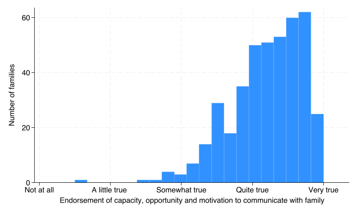

```{r}
#| include: false
stataexe <- "/Applications/StataNow/StataSE.app/Contents/MacOS/stata-se"
knitr::opts_chunk$set(engine.path=list(stata=stataexe))
library(Statamarkdown)
```


## Create and recode variables
::: {.callout-note collapse=true title="Expand for code"}

#### Center covariates on mean

```stata
egen i2scale_std=std(i2scale_unstd) // added to create_var-5
sum(relatives),de  // added to create_var-6
gen c_relatives=(relatives - r(p50))/5 // added to create_var-7
```


#### Generate mean family female proportion

We use this to test the homogeneity of the female coefficient (make sure it is similar at the relative and enrolled subject level and that there isn't some additional effect on the outcome of families that have particularly high proportions of female relatives, apart from the individual effect of a relative's gender)

```stata
egen m_female=mean(female), by(access_code) // added to create_var-8
```

::: {.callout-note collapse=true title="Full create and label variable commands"}
```{stata}
*| code-fold: true
type sub/create_vars.do
```
:::


:::


## Assessment of family communication scale

### Scale items

**Supplemental Table 2. Assessment of Family Communication Scale items
and attributes (Score created from 20 5-point Likert items. Range 1-5.
α = .81.).** Note that i2_h i2_i i2_p i2_q i2_r i2_s i2_t response
categories were reversed coded in the scale score.

*Thinking about talking with your biological family about genetic
testing for cancer risk, how true are each of the statements below?
(*Not at all true/A little true/Somewhat true/Quite true/Very true)

a\. I understand my genetic test results well enough to talk about them
with my family members  
b\. I am comfortable talking to my family members about my genetic test
results  
c\. I am confident that I can talk with my family members about genetic
testing  
d\. I have enough time to reach out to my family members and talk with
them about genetic testing  
e\. My family is comfortable talking about genetic testing for cancer
risk  
f\. I can handle the emotions of my family members when talking about
genetic testing  
g\. I can handle my own emotions when talking with my family members
about genetic testing  
h\. I don't know which family members I should talk with about genetic
testing for cancer risk  
i\. I feel as though there's nothing more I can do to encourage my
family members to get genetic testing  
j\. My family members have asked me about my genetic test results  
k\. I believe that genetic testing can help prevent cancer in my family
members  
l\. I want my family members to get genetic testing  
m\. A health care provider or genetic counselor encouraged me to share
my genetic test results with my family members  
n\. I believe that my genetic test results are useful to my family
members  
o\. I feel that it is my responsibility to share my genetic test results
with my family members  
p\. I believe that sharing my genetic test results will burden my family
members  
q\. I feel that my genetic test results are too personal to share with
my family members  
r\. I believe that it would be difficult for my family members to afford
the cost of genetic testing for cancer risk  
s\. My family members have asked me not to talk with them about my
genetic test results  
t\. I feel that nothing can be done to prevent cancer

### Create and describe communication scale

```{stata}
*| eval: true
*| code-fold: true
run sub/load_data.do
* generate the i2scale without missing values and empirical reversals
alpha i2_a-i2_t  
foreach var in i2_h i2_p i2_q i2_r i2_s i2_t {
    qui recode `var'  (0 = 4) (1 = 3) (2 = 2) (3 = 1) (4 = 0)
}  // added to create_var-3
qui alpha i2_a-i2_t,gen(i2scale_unstd) // added to create_var-4
bysort access_code: gen id=_n // added to create_vars-2
qui hist i2scale_unstd if id==1,freq ytitle(Number of families) ///
	xlab(0 "Not at all" 1 "A little true " 2 "Somewhat true" ///
	3 "Quite true" 4 "Very true") xscale(range(0 4.3)) ///
	xtitle("Endorsement of capacity, opportunity and motivation to communicate with family")
qui graph export img/fam_comm.png,replace
```

#### Distribution of family communication scale

