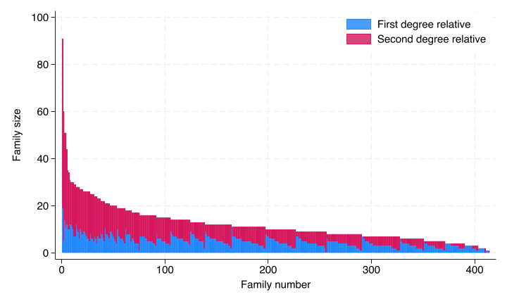

# Descriptives

```{r}
#| include: false
stataexe <- "/Applications/StataNow/StataSE.app/Contents/MacOS/stata-se"
knitr::opts_chunk$set(engine.path=list(stata=stataexe))
library(Statamarkdown)
```

## Number of eligible relatives


## Number of relatives invited

```{stata}
*| code-fold: true
run sub/load_data.do
collapse (mean) relatives (sum) invite ,by(access_code) 
sort invite
tab invite
* Note that 275 families, or 67% had no testing
qui sum invite
di "Total number of invited relatives = " r(sum)
scalar total_invited = r(N)
qui count if invite==0
scalar none_invited=r(N)
```

About one third of families invited no relatives (134/414= `r round(134/414,2)` ) 


## Number of relatives tested
```{stata}
*| code-fold: true
run sub/load_data.do
collapse (mean) relatives (sum) test ,by(access_code) 
sort test
label var test "Tested"
table test
* Note that 275 families, or 67% had no testing
qui sum test
di "Total number of tested relatives = " r(sum)
scalar total_tested = r(N)
qui count if test==0
scalar none_tested=r(N)
```

We see the data is very lopsided as two-thirds of families had no relatives tested (279/414 = `r round(279/414,2)).

## Total number of eligible relatives by degree

```{stata}
*| eval: true
*| code-fold: true
run sub/load_data.do
run sub/create_vars.do


collapse (count) id  ,by(access_code degree2) 
tab degree2,sum(id)
qui reshape wide id, i(access_code) j(degree2)
mvencode id0 id1 , mv(0)
gen sum = (id0+id1)


gsort -sum -id0
gen family=_n
twoway bar id0 family || rbar id0 sum family, ///
	legend(position(0) bplacement(neast)  ///
	label(1 "First degree relative") label(2 "Second degree relative" )) ///
	ytitle("Family size") xtitle("Family number")

graph export "img/fam_size.png",replace
```




Average number of relatives of each type
```{stata}
*| code-fold: true
*| eval: true
run sub/load_data.do
gen degree2=reldegree-1     // added to create_vars-1
bysort access_code: gen id=_n // added to create_vars-2
collapse (count) id  ,by(access_code degree2) 
tab degree2,sum(id)
qui sum id
di "Total number of eligible relatives is " r(sum)
di "Standard deviation of number of relatives is " r(sd)
```


## Empty model: Proportion of relatives invited and tested


```{stata}
*| eval: true
*| code-fold: true
run sub/load_data.do
run sub/create_vars.do

melogit invite || access_code: , nolog
estat icc
local icc = r(icc2)
margins 
etable ,margins cstat(_r_b,  nformat(%4.2f)) ///
	cstat(_r_ci, cidelimiter(", ") nformat(%4.2f)) ///
	mstat(ICC=`icc') column(dvlabel)

melogit test || access_code: , nolog
estat icc
local icc = r(icc2)
margins 
qui etable ,margins cstat(_r_b,  nformat(%4.2f)) ///
	cstat(_r_ci, cidelimiter(", ") nformat(%4.2f)) ///
	mstat(ICC=`icc') column(dvlabel) ///
	title("Table: Overall rates of invitation and testing ") ///
	notes("Estimates other than ICC are predicted probabilities (CI) averaged over the random effects")  ///
	notes("The predicted probabilities are averaged over the testing conditions as well") ///
	append  eqrecode(test = xb invite = xb) ///
	export(sub/table_means.html,replace)
```


:::: {.columns}

::: {.column width="10%"}
  
:::
::: {.column width="60%"}

:::
::: {.column width="30%"}

:::
::::

### Discussion of empty model

That's a big ICC!  almost half the variance is between families for both invitation to the website and testing 
