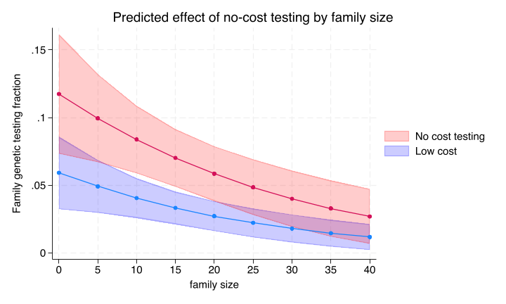
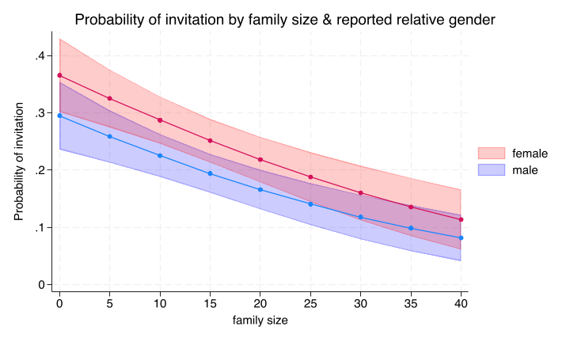
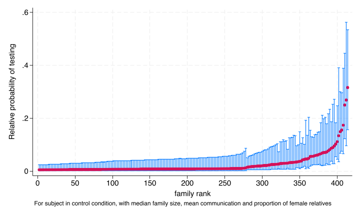
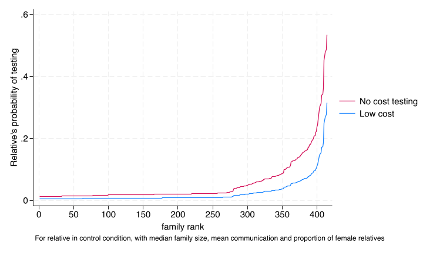
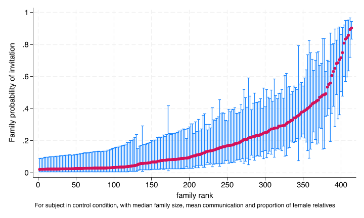

These analyses were not pre-specified but were done for exploratory purposes after the data was collected.

```{r}
#| include: false
stataexe <- "/Applications/StataNow/StataSE.app/Contents/MacOS/stata-se"
knitr::opts_chunk$set(engine.path=list(stata=stataexe))
library(Statamarkdown)
```

## Variation in outcomes by elgible relative degree (first vs second)

It became obvious in looking at the data that testing varied substantially be whether eligible relatives were first or second degree.  This probably should have been obvious to us ahead of time but we did not include this variable in our group of pre-specified variables.  Nevertheless, for future studies it obviously is useful to consider both the analytic implications of this finding but also consider how to adjust implementation approaches to take account of these differences 

### Overall differences in testing and invitation by relative degree
```{stata}
*| eval: false
*| code-fold: true
run sub/load_data.do
run sub/create_vars.do

qui melogit invite i.degree2 || access_code: , nolog or
est store test2
estat icc

etable, cstat(_r_b,  nformat(%4.2f)) keep(i.degree2) ///
	cstat(_r_ci, cidelimiter(", ") nformat(%4.2f)) ///
	mstat(ICC=r(icc2)) column(dvlabel) 
eststo melogit1_m:margins degree2, post

	
qui melogit test i.degree2 || access_code: , nolog or
estat icc

etable, cstat(_r_b,  nformat(%4.2f)) keep(i.degree2) ///
	cstat(_r_ci, cidelimiter(", ") nformat(%4.2f)) ///
	mstat(ICC=r(icc2)) column(dvlabel) ///
	title("Table: Relationship of family degree to invitation and testing") ///
	notes("Odds ratio (CI)") ///
	append  eqrecode(test = xb invite = xb) ///
	export(sub/table_degree_or.html,replace)

eststo melogit2_m:margins degree2, post
estout melogit2_m melogit1_m using "sub/table_degree.html", ///
	c(b(nostar fmt(2)) ci(par fmt(2)) )  ///
	label coll("" ) mlabel("Invitation" "Testing") ///
	style(html) replace top(sub/tab_top.html) bot(sub/tab_bot.html) 
```

Marginal probabilities averaged over all other variables including intervention arm.

{width="100%" height="150px"}

First degree relatives are observed in the data to be over 3 times as likely to get invited and tested as compared to secondary degree relatives (not accounting for any of the design features of the trial)


### Including relative degree in the protocol specified model for testing

In the testing model, the relative degree had a large coefficient (-1.6 or an odds ratio of `r round(exp(-1.6),2)`).  However, including the relative degree had relatively little effect on the other coefficients including the intervention coefficients.

```{stata}
*| eval: true
*| code-fold: true
run sub/load_data.do
run sub/create_vars.do
* Full model
*qui melogit test i.costarm i.navarm c_relatives i2scale_std ///
	female || access_code: , eform
qui {
melogit test i.costarm i.navarm c_relatives i2scale_std ///
	female  || access_code: , nolog
est store protocol
melogit test i.costarm i.navarm c_relatives i2scale_std ///
	female i.degree2 || access_code: , nolog
est store degree
}

etable ,cstat(_r_b) cstat(_r_ci, cidelimiter(", ") nformat(%4.2f)) ///
     estimates(protocol degree) column(estimates)
estat icc
```

### Including relative degree in the protocol specified model for invitation

For the invitation model, the relative degree coefficient was even larger (-2.4 or an odds ratio of `r round(exp(-2.4),2)`).  This inflated some of the coefficients as expected (given that the error variance of a logistic regression is constrained to be $\pi^2/3$).  There was a larger point estimate for the effect of the free testing intervention but similar to the protocol analysis the confidence intervals still crossed one.

The residual error variance is substantially larger with the inclusion of relative degree.  Some of this is clearly related to the re-scaling of coefficients after including a highly predictive variable.  But it certainly does not provide any support for the possibility that differences in the proportion of second degree relatives explains some of the heterogeneity in invitation rates.

Relative degree is clearly an important variable to think about in the analysis and design of efforts to improve cascade testing.

```{stata}
*| eval: false
*| code-fold: true
run sub/load_data.do
run sub/create_vars.do
* Full model
*qui melogit invite i.costarm i.navarm c_relatives i2scale_std ///
	female || access_code: , eform
qui {
melogit invite i.costarm i.navarm c_relatives i2scale_std ///
	female  || access_code: , nolog
est store protocol
melogit invite i.costarm i.navarm c_relatives i2scale_std ///
	female i.degree2 || access_code: , nolog
est store degree
}

etable ,cstat(_r_b) cstat(_r_ci, cidelimiter(", ") nformat(%4.2f)) ///
     estimates(protocol degree) column(estimates)
estat icc

```

## Variation in outcomes by family size

### Testing by family size

Family size is an important baseline predictor of testing

```{stata, echo=3:7}
*| eval: false
*| code-fold: true
*| output: false
run sub/load_data.do
run sub/create_vars.do
* Full model
qui melogit test i.costarm i.navarm c.relatives i2scale_std ///
	female || access_code: , eform
qui margins costarm,at(relatives=(0(5)40) navarm=0)
marginsplot, ///
	legend(order(2 "No cost testing" 1 "Low cost"))  /// 
	ytitle("Family genetic testing fraction") xtitle(family size) ///
	recastci(rarea) ci1opts(astyle(ci) acolor(blue%20)) ///
	ci2opts(astyle(ci) acolor(red%20)) ///
	title(Predicted effect of no-cost testing by family size)
qui graph export img/test_outcome_by_fam_size.png,replace
```





### Invitation by family size and gender

While neither intervention had a significant impact for the invitation outcome, the invitation rate does vary considerably by family size and the reported gender of the relative.

```{stata}
*| eval: false
*| code-fold: true
*| output: false
run sub/load_data.do
run sub/create_vars.do
* Full model
qui melogit invite i.costarm i.navarm relatives i2scale_std ///
	i.female || access_code: , eform
qui margins female ,at(relatives=(0(5)40) navarm=0)
marginsplot, ///
	legend(order(2 "female" 1 "male"))  /// 
	ytitle("Probability of invitation") xtitle(family size) ///
	recastci(rarea) ci1opts(astyle(ci) acolor(blue%20)) ///
	ci2opts(astyle(ci) acolor(red%20)) ///
	title(Probability of invitation by family size & reported relative gender)
qui graph export img/invite_outcome_by_fam_size.png,replace
```



## Heterogeneity in outcomes across families

### Heterogeneity in family testing rates

```{stata}
*| eval: false
*| code-fold: true
run sub/load_data.do
run sub/create_vars.do
* Full model
qui melogit test i.costarm i.navarm c_relatives i2scale_std ///
	female || access_code: , eform
* Caterpillar graph
qui predict re_effect,reffects ebmeans reses(re_ses)
* Generate overall mean family proportion female
sum(female),meanonly
local m_female=r(mean)
* male, control arms:  mean i2 female and relatives
gen re_prob=   invlogit(_b[_cons] + _b[female]*`m_female' + re_effect)
gen re_prob_ul=invlogit(_b[_cons] + _b[female]*`m_female' + re_effect ///
	+ 1.39*re_ses)
gen re_prob_ll=invlogit(_b[_cons] + _b[female]*`m_female' + re_effect ///
	- 1.39*re_ses)
* use 1.39 for testing equality of a series of level 2 residuals at 5% signfificance level 
* Snijders ML analysis 2nd ED p66 , Goldstein 1995 p175
gen re_prob2=   invlogit(_b[_cons] + _b[female]*`m_female' + re_effect ///
	+ _b[1.costarm]*1 )
bysort access_code: gen first=_n==1
gsort +re_prob -first
generate rank = sum(first)
twoway rcap re_prob_ul re_prob_ll rank if first==1&mod(rank,2)==0 || ///
	scatter re_prob rank if first==1&mod(rank,2)==0, ///
	xtitle("family rank") xlab(0(50)400) ytitle("Relative probability of testing") legend(off) ///
	note("For subject in control condition, with median family size, mean communication and proportion of female relatives") 
qui graph export img/caterpillar.png,replace
twoway line re_prob re_prob2 rank if first==1, ///
	xtitle("family rank") xlab(0(50)400) ///
	ytitle("Relative's probability of testing") ///
	legend(order(2 "No cost testing" 1 "Low cost")) ///
	note("For relative in control condition, with median family size, mean communication and proportion of female relatives")
qui graph export img/test_outcome_by_fam_rank.png,replace
```




There is a lot of variation in predicted testing conditional being in the control condition for both interventions.  These curves would be shifted upward by the odds ratio for each of the interventions.
You also see the very large number of subjects with a low to 0% predicted probability of testing in keeping with the raw data.

Below we see the distribution of the family probability of testing separately by intervention status, but ordered by the testing rank of the families (from 1 lowest overall probability of testing to rank 400, highest rank of testing).




### Heterogeneity in family invitation rates

```{stata, echo=3:25}
*| eval: false
*| code-fold: true
run sub/load_data.do
run sub/create_vars.do
* Full model
qui melogit invite i.costarm i.navarm c_relatives i2scale_std ///
	female || access_code: , eform
* Caterpillar graph
qui predict re_effect,reffects ebmeans reses(re_ses)

* Generate overall mean family proportion female
sum(female),meanonly
local m_female=r(mean)
* male, control arms:  mean i2 female and relatives
gen re_prob=   invlogit(_b[_cons] + _b[female]*`m_female' + re_effect)
gen re_prob_ul=invlogit(_b[_cons] + _b[female]*`m_female' + re_effect ///
	+ 1.39*re_ses)
gen re_prob_ll=invlogit(_b[_cons] + _b[female]*`m_female' + re_effect ///
	- 1.39*re_ses)
* use 1.39 for testing equality of a series of level 2 residuals at 5% signfificance level 
* Snijders ML analysis 2nd ED p66 , Goldstein 1995 p175
bysort access_code: gen first=_n==1
gsort +re_prob -first
generate rank = sum(first)
qui twoway rcap re_prob_ul re_prob_ll rank if first==1&mod(rank,2)==0 || ///
	scatter re_prob rank if first==1&mod(rank,2)==0, ///
	xtitle("family rank") xlab(0(50)400) ytitle("Family probability of invitation") legend(off) ///
	note("For subject in control condition, with median family size, mean communication and proportion of female relatives") saving(caterpillar,replace)
qui graph export img/invite_caterpillar.png,replace	
```




This illustrates the even larger amount of variation in predicted invitation conditional on being in the control condition for both interventions.  
You also see the smaller number of subjects with a low to 0% predicted probability of testing in keeping with the raw data.

The subjects have a considerably higher probability of inviting relatives with the website as compared to the proportion that ultimately get tested.  However, the overall proportion of relatives invited is still under 25%.
