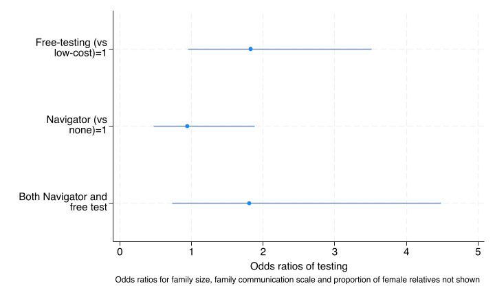
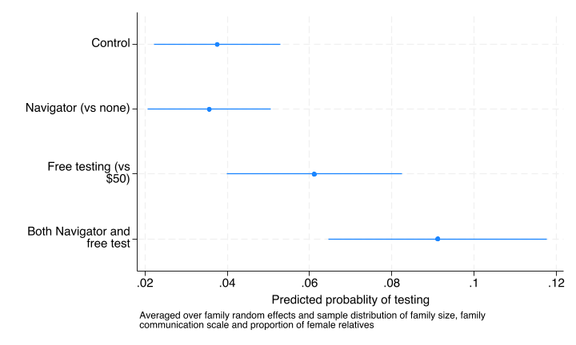
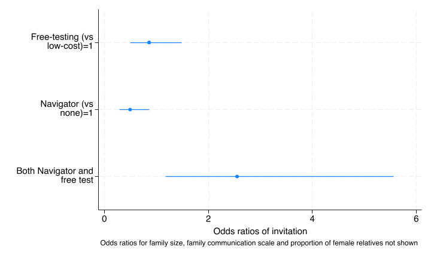
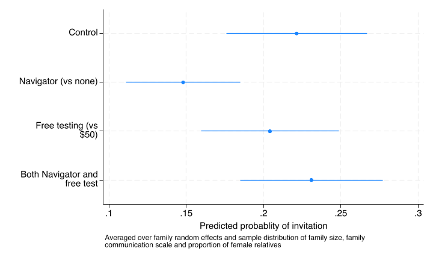

```{r}
#| include: false
stataexe <- "/Applications/StataNow/StataSE.app/Contents/MacOS/stata-se"
knitr::opts_chunk$set(engine.path=list(stata=stataexe))
library(Statamarkdown)
```

During the review process a reviewer requested that we provide an analysis of the interaction between the two interventions, free vs low cost and navigator vs no navigator and we provide that analysis below.  We had not planed to conduct this analysis for reasons outlined first.  

## Rationale for not examining interactions

### Lack of prior belief in a mechanism of interaction

In carrying out the primary analysis for the main trial results we committed ourselves to follow the protocol as pre-specified and previously published (PMID: 40016666).  There we provide the following justification following the Consort extensions for factorial trials which specifies that “For trials in which evaluation of interaction(s) is not deemed essential, this decision should be justified.” (item-17a, PMID: 38051324): 

Our justification, as prespecified in the protocol paper (@Katz_2025_25_366), was given as follows:

>“First, we do not hypothesize that there will be any synergistic effect of the two treatments on the log odds scale and thus assume that the effects will be additive. Conceptually we cannot think of any reason that the effect of the cost of the testing and any help provided by a navigator over the website have an obvious reason to be dependent on the level of the other. Thus, our primary outcome for the primary and secondary aims is the treatment effect of each intervention in a regression model without an interaction term.”   

### Inadequate power and risk of type 2, type M and type S errors

#### True interaction effect size was anticipated to be small during trial design

1. We did not anticpate any synergism between the two interactions which would result in an effect size close to 0. 
2. Factorial designs are often employed for the increased efficiency that occurs in the absence of interactions between factors and this is often justified by invoking the "hierarchical ordering princple" which says that lower order effects (such as main effects) tend to be more important than higher order effects.  There are both theoretical and empircal justifications for this princple.(@Wu_2011, @Li_2006_11_32, @Montgomery_2013) This gives rise to a common default in the absence of prior information or strong theory of proposing that interactions effects are about half the magnitude of main effects when designing experiments.

#### Interaction terms require 16 times the sample size as main effects

If the true interaction effect is zero or close to it, as we hypothesized, then the sample size for detecting an interaction would increase twoward infinity as the true effect approached 0.  If, as an upper limit,  one hypothesizes an interaction effect that is half the size of a main effect, then the sample size required to detect a statistically significant difference is 16 times the sample size that is required to detect a main effect (see [this source](https://statmodeling.stat.columbia.edu/2018/03/15/need16/) for a description of how you would calculate this).  Given the difficulty of achieving sample sizes sufficient to detect main effects in most clinical trials, interaction effects are likely to almost always be severely underpowered.

#### There are risks of estimating underpowered effects

The obvious risk of estimating effects when the sample size is too small is that a type 2 error occurs and you accept the null hypothesis when it is not true.   However recent work has shown 2 additional errors that can occur which have been given the names of type M and type S errors (@Gelman_2014_9_641;@vanZwet_2021_40_6107)  A type M error is an exaggeration error, the risk that with an inadequate sample size and a small true effect, that in a given sample from the population a statistically signficant result will be exaggerated relative to the true effect size.  A type S error is the risk of a reversal of the sign of the observed effect with respect to the true effect.

The magnitude of these errors can be calculated using an R package called retrodesign. (Timm A (2024). _retrodesign: Tools for Type S (Sign) and Type M (Magnitude) Errors_. R  package version 0.2.2, <https://CRAN.R-project.org/package=retrodesign>.)  


```{r}
#| echo: FALSE
main_effect<-log(1.7)
true_interaction_effect<-main_effect/2  # upper limit proposed based on theory and hierarchcial ordering princple
std_error_interaction<-0.49  # observed
cat("Main effect specified in design (coefficient)", round(main_effect,2), "(o.r.",exp(main_effect),")","\n")
cat("True intervention effect",round(true_interaction_effect,2),"(half of main effect)","\n")
cat("Observed interaction standard error",round(std_error_interaction,2),"\n")
```

```{r}
retrodesign::retrodesign(true_interaction_effect,std_error_interaction)
```

The design analysis shows the power to detect the interaction is 0.07 and the type M error is 4.4 (based on the observed standard error for the interaction from the interaction analysis below and the upper limit of the likely true effect size).  This suggests that if one observed a statistically significat effect it would be on average over four times as large as the true effect.  There is a 7% chance that the sign would be in the opposite direction to the true effect. 

We can also run a simulation to illustrate the problem directly.

```{r}
retrodesign::sim_plot(true_interaction_effect,std_error_interaction)
```

#### A bayesian analysis would have addressed this

Had we proposed to do a bayesian analysis we would have put a weakly informative prior on the interaction (and main effects) and the regularization that occurs with placing a prior on the coefficients would have addressed a lot of the problems noted above that are created by trying to esimate an underpowered interaction term.

## Estimating the interactions of the two interventions

As the reviewer requested an analysis of the interactions it is provided below.  Given the reasoning above, we were not surprised to find that the effects are noisy and we would tend to avoid trying to interpret them.

### Primary outcome - genetic testing


```{stata}
run sub/load_data.do
run sub/create_vars.do
qui melogit test i.costarm i.navarm c_relatives i2scale_std ///
	female || access_code: , nolog
est store test_nointer
qui melogit test i.costarm##i.navarm c_relatives i2scale_std ///
	female || access_code: , nolog or
est store test_inter
lrtest test_nointer test_inter

coefplot,coeflabels(0.costarm#0.navarm ="Control" ///
	0.costarm#1.navarm ="Navigator (vs none)" 1.costarm#0.navarm ="Free testing (vs $50)" ///
	1.costarm#1.navarm ="Both Navigator and free test",wrap(20)) ///
    drop(c_relatives female _cons i2scale_std) eform ///
	xtitle(Odds ratios of testing) ///
	note("Odds ratios for family size, family communication scale and proportion of female relatives not shown" ) 
qui graph export img/test_inter_coef.png,replace
	
qui margins i.costarm#i.navarm, post

coefplot,coeflabels(0.costarm#0.navarm ="Control" ///
	0.costarm#1.navarm ="Navigator (vs none)" 1.costarm#0.navarm ="Free testing (vs $50)" ///
	1.costarm#1.navarm ="Both Navigator and free test",wrap(20)) ///
	xtitle(Predicted probablity of testing) ///
	note("Averaged over family random effects and sample distribution of family size, family " ///
  	"communication scale and proportion of female relatives" ) 
qui graph export img/test_inter_marg.png,replace
```

The likelihood ratio is not significant suggesting that the interaction does not improve the fit of the model. 

#### Odds ratios including interaction



#### Marginal probabilities of testing including interaction



#### Summary

Using a standard frequentist framework one would not include the interaction given the non-significant likelihood ratio test.  We would be more cautious and say that there is a high likelihood of a type 2 error in drawing conclusions about the interaction based on the data but that our prior propositon was that there was unlikely to be anything other than a small interaction between the two arms.

### Primary outcome - invitation

```{stata}
run sub/load_data.do
run sub/create_vars.do
qui melogit invite i.costarm i.navarm c_relatives i2scale_std ///
	female || access_code: , nolog	
est store invite_nointer
qui melogit invite i.costarm##i.navarm c_relatives i2scale_std ///
	female || access_code: , nolog
est store invite_inter
lrtest . invite_nointer
	
coefplot,coeflabels(0.costarm#0.navarm ="Control" ///
	0.costarm#1.navarm ="Navigator (vs none)" 1.costarm#0.navarm ="Free testing (vs $50)" ///
	1.costarm#1.navarm ="Both Navigator and free test",wrap(20)) ///
    drop(c_relatives female _cons i2scale_std) ///
	xtitle(Odds ratios of invitation) eform ///
	note("Odds ratios for family size, family communication scale and proportion of female relatives not shown" ) 
qui graph export img/invite_inter_coef.png,replace

qui margins i.costarm#i.navarm, post

coefplot,coeflabels(0.costarm#0.navarm ="Control" ///
	0.costarm#1.navarm ="Navigator (vs none)" 1.costarm#0.navarm ="Free testing (vs $50)" ///
	1.costarm#1.navarm ="Both Navigator and free test",wrap(20)) ///
	xtitle(Predicted probablity of invitation) ///
	note("Averaged over family random effects and sample distribution of family size, family " ///
  	"communication scale and proportion of female relatives" ) 
qui graph export img/invite_inter_marg.png,replace
```


The likelihood ratio is significant at a level of 0.02 suggesting that the interaction improves the fit of the model. 

#### Odds ratios including interaction



#### Marginal probabilities of testing including interaction



#### Summary

Using a standard frequentist framework one might argue to include this interaction given the significant likelihood ratio test.  We would be more cautious and say that there is a high likelihood of a type M error in the estimation of the interaction coefficient, with the observed interaction likely being exaggerated by an average of over 4 times compared to the true interaction magnitude.  

## Interpretation

Some researchers label attempts to interpret analyses for which the sample size is inadequate as "story time" ([see Gelman 2010](https://statmodeling.stat.columbia.edu/2010/10/15/story_time/)), others label it more optimistically as "hypothesis generating interpretation". 

Whichever label one might prefer, it is difficult to try to interpret these results which we feel is a result of the fact that they likely represent noise.  

Looking at the __invitation model__ where the interaction is "statistically signficant", neither intervention increases invitation (stable invite proportion 20-22%) but patients exposed to the navigator in the control cost arm have a lower invitation proportion.  The navigator had no professional expertise in genetics and was not able to offer opinions about the specific usefulness or lack of usefulness of of testing for specific relatives under cost constraints.  The navigator was simply there to help with navigating the process and giving advice on how to talk to relatives.  So it is difficult to even speculate about a mechanism for this finding.

If one were to infer from the interaction analysis of the invitation outcome that the availability of the navigator decreased invitations when paired with the low-cost control intervention arm, then one might be tempted to intepret the __testing model__ with the interaction as suggesting a modest net positive effect of the navigator _once people are invited_. In this story, the Navigator:low-cost arm has similar testing rates to the No-navigator:low-cost control arm, despite a lower invitation rate. This might suggest that the navigator exposure increases the conversion of invited relatives to tested relatives relative to the conversion that occurs in the absence of a navigator. Similarly the point effect in the Navigator:free-test arm is modestly higher than the free-test only arm which might seem to again suggest that the navigator exposure increases the conversion of invited relatives to tested relatives.  

There are two reasons to be cautious with this interpretation of point estimates.  First, the confidence intervals in the testing model substantially overlap other than for the marginal effect of free-test (third and fourth rows in the graph) vs low-cost test (first two rows in the graph).  Second, inferences about proportion tested once invited is a form of simplistic mediation analysis which is a non-randomized comparison.  Invitation to testing occurs after randomization and the invitation to testing is not randomly assigned to relatives within family.  At best one could do an observational formal mediation analysis which would require adjustment for a number of potential confounders, as in any observational analysis, as opposed to the randomized comparisons we present where balance of confounders can be assumed.

For these reasons, and in consideration of the cautions described above, we would not try to draw conclusions about the interaction analysis based on this data or even interpret the findings as hypothesis generating.

## References