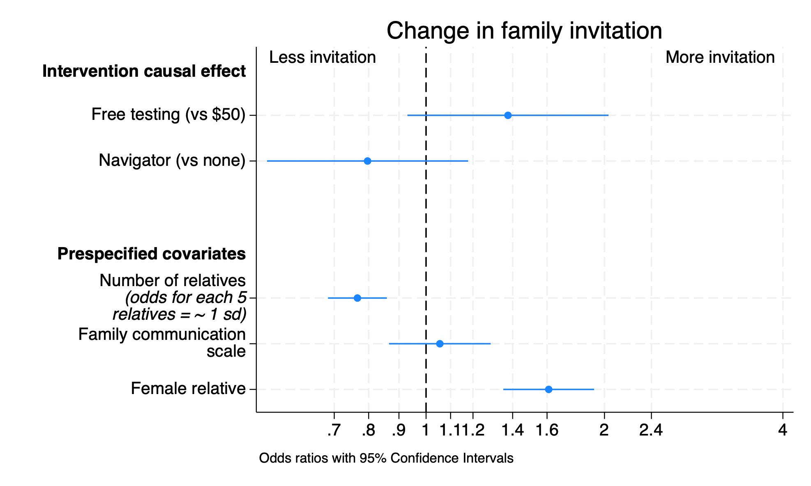
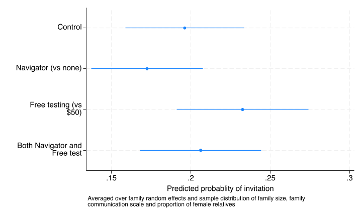

```{r}
#| include: false
stataexe <- "/Applications/StataNow/StataSE.app/Contents/MacOS/stata-se"
knitr::opts_chunk$set(engine.path=list(stata=stataexe))
library(Statamarkdown)
```

The first pre-specified secondary outcome was whether or not each eligible relative was invited to the study by the index patient enrolled in the study.

##  Invitation outcome regresssion

```{stata}
*| eval: true
*| code-fold: false
run sub/load_data.do
run sub/create_vars.do
melogit invite i.costarm i.navarm c_relatives i2scale_std ///
	female || access_code: , nolog
estat icc
qui est save sub/invite_result, replace
```

### Odds ratio for invitation 


```{stata}
*| eval: false
*| code-fold: true
est use sub/invite_result

coefplot, drop(_cons) eform xscale(log) ///
	xlab(.7 .8 .9 1.0 1.1 1.2 1.4 1.6 2 2.4 4) xline(1) ///
	coeflabels(1.costarm = "Free testing (vs $50)" 1.navarm="Navigator (vs none)" /// 
		c_relatives=`"Number of relatives {it:(odds for each 5} {it:relatives = ~ 1 sd)}"' ///
		i2scale_std="Family communication scale" ///
	female="Female relative",wrap(25)) ///
	headings(1.costarm="{bf:Intervention causal effect}" ///
		c_relatives="{bf:Prespecified covariates}") ///
	title("Change in family invitation") ///
	text(.7 3.14 "More invitation") text(.7 .67 "Less invitation") ///
	note("Odds ratios with 95% Confidence Intervals")
graph export "img/invite_odds.png", replace
```

### Supplemental Figure 3



```{stata}
*| eval: false
*| code-fold: true
est use sub/invite_result
* OR table
collect clear
collect _r_b _r_ci: qui melogit,or
collect addtags rowheader["Interventions"], fortags(colname[i.costarm i.navarm])
collect addtags rowheader["Covariates"], fortags(colname[c_relatives i2scale_std female])
collect layout (rowheader#colname) (result)
collect label levels result _r_b "Odds ratio" ,modify
collect label levels colname c_relatives "Larger family(per 5 relatives)" ///
	i2scale_std "Family communication (per s.d.)" ///
	female "Female relative",modify
collect style showbase off
collect style cell, nformat(%5.2f)
collect style cell result[_r_ci], sformat("[%s]") cidelimiter(", ")
collect style cell result[_r_b], halign(center)
collect style cell border_block, border(right, pattern(nil))
collect preview
collect export sub/table_invite_or.html,replace
```


{width="100%" height="200px"}


It is somewhat counterintuitive that the Navigator intervention has a point effect odds ratio less than one, although the confidence interval considerably overlaps with one so it is most consistent with no difference.

### Marginal probability of testing for each intervention group

```{stata}
*| eval: false
*| code-fold: true
run sub/load_data.do
run sub/create_vars.do
est use sub/invite_result
estimates esample:invite costarm navarm c_relatives i2scale_std female 

qui margins costarm#navarm,post
coefplot,coeflabels(0.costarm#0.navarm ="Control" ///
	0.costarm#1.navarm ="Navigator (vs none)" 1.costarm#0.navarm ="Free testing (vs $50)" ///
	1.costarm#1.navarm ="Both Navigator and Free test",wrap(20)) ///
	xtitle(Predicted probablity of invitation) ///
	note("Averaged over family random effects and sample distribution of family size, family " ///
  	"communication scale and proportion of female relatives" ) 
graph export "img/invite_group_pred.png",replace
```



### Causal effect (risk difference) for each intervention

```{stata}
*| eval: false
*| code-fold: true
run sub/load_data.do
run sub/create_vars.do
est use sub/invite_result
estimates esample:invite costarm navarm c_relatives i2scale_std female 

* table invite
di "Invitation Cost when at control Navigation"
label var invite "Navigator=0"
margins r.costarm ,at(navarm=0)
etable ,cstat(_r_b,  nformat(%4.2f)) ///
	cstat(_r_ci, cidelimiter(", ") nformat(%4.2f)) margins
di "Main results Navigation"
label var invite "Cost=0"
margins r.navarm ,at(costarm=0)
etable ,cstat(_r_b,  nformat(%4.2f)) ///
	cstat(_r_ci, cidelimiter(", ") nformat(%4.2f)) ///
	margins append column(dvlabel) ///
	title("Table: Difference in invitation rates for each intervention ") ///
	notes("Predicted probability at the control condition of the other intervention") ///
	export(sub/table_invite.html,replace)
```

{width="100%" height="300px"}

### Table of group outcomes and causal effect combined

```{stata}
*| eval: false
*| code-fold: true
run sub/load_data.do
run sub/create_vars.do
est use sub/invite_result
estimates esample:invite costarm navarm c_relatives i2scale_std female 

* combined invite result table
collect clear
collect _r_b _r_ci,tags(rowheader["Group means cost"]): margins costarm,at(navarm=0)
collect _r_b _r_ci,tags(rowheader["Difference (cost)"]): margins r.costarm,at(navarm=0)
collect _r_b _r_ci,tags(rowheader["Group means navigator"]): margins navarm,at(costarm=0)
collect _r_b _r_ci,tags(rowheader["Difference (navigator)"]): margins r.navarm,at(costarm=0)
collect style cell, nformat(%5.2f)

// Capture the number of families
local fam_num=e(N_g)[1,1]
local obs_num = e(N)

// Add Number of families row first (before Observations)
collect get num_families = `fam_num', tags(row[num_families])
collect label levels row num_families "Number of index patients", modify
collect recode result num_families=_r_b
collect style cell row[num_families], nformat(%5.0f)

// Add "Observations" row
collect get num_obs = `obs_num'', tags(row1[num_obs])
collect label levels row1 num_obs "Number of relatives", modify
collect recode result num_obs=_r_b
collect style cell row1[num_obs], nformat(%5.0f)

collect style cell result[_r_ci], sformat("[%s]") cidelimiter(", ")
collect style cell result[_r_b], halign(center)
collect label levels colname 1.costarm "Free (no navigator)" 0.costarm  "Low-cost (no navigator)" r1vs0.costarm "Free vs low-cost" 1.navarm "Navigator (low-cost)" 0.navarm "No Navigator (low cost)" r1vs0.navarm "Navigator vs none"
collect label levels result _r_b "Proportion",modify

collect layout (rowheader#colname row row1)  (result) 
collect preview
collect save sub/table_invite_result,replace
collect export sub/table_invite_result.html,replace
```

{width="100%" height="300px"}

