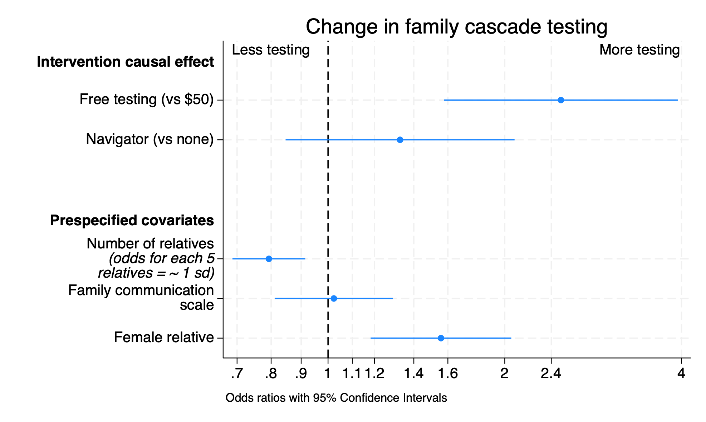
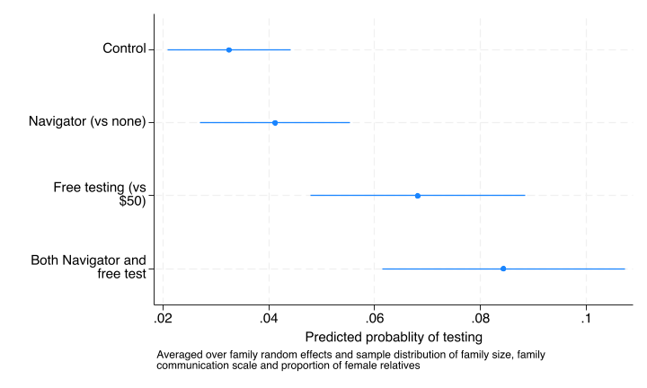

```{r}
#| include: false
stataexe <- "/Applications/StataNow/StataSE.app/Contents/MacOS/stata-se"
knitr::opts_chunk$set(engine.path=list(stata=stataexe))
library(Statamarkdown)
```

The pre-specified primary outcome was whether or not each relative received gentic testing via Color.

## Primary outcome regresssion

A multilevel logistic regression was estimated which included the two intervention arms as main effects along with three pre-specified covariates. These included one relative level variable to try to ensure better balance (relative sex) and two cluster level variables to improve efficiency through the use of predictors of variation in the outcome at the cluster level (family size and baseline comfort with communication).(@Hemming_2025_391_e084194)

```{stata}
*| eval: true
*| code-fold: false
run sub/load_data.do
run sub/create_vars.do
* Full model
melogit test i.costarm i.navarm c_relatives i2scale_std ///
	female || access_code: , nolog
estat icc
qui est save sub/main_result,replace
```

### Figure 3

Odds ratio for testing

```{stata}
*| eval: false
*| code-fold: true
est use sub/main_result
coefplot, drop(_cons) eform xscale(log) ///
	xlab(.7 .8 .9 1.0 1.1 1.2 1.4 1.6 2 2.4 4) xline(1) ///
	coeflabels(1.costarm = "Free testing (vs $50)" 1.navarm="Navigator (vs none)" /// 
		c_relatives=`"Number of relatives {it:(odds for each 5} {it:relatives = ~ 1 sd)}"' ///
		i2scale_std="Family communication scale" ///
	female="Female relative",wrap(25)) ///
	headings(1.costarm="{bf:Intervention causal effect}" ///
		c_relatives="{bf:Prespecified covariates}") ///
	title("Change in family cascade testing") ///
	text(.7 3.4 "More testing") text(.7 .8 "Less testing") ///
	note("Odds ratios with 95% Confidence Intervals")
graph export "img/testing_odds.png",replace
```

Figure 3 in the published article (will be provided here after publication) <!--

-->

```{stata}
*| eval: false
*| code-fold: true
est use sub/main_result
* OR table
collect clear
collect _r_b _r_ci: qui melogit,or
collect addtags rowheader["Interventions"], fortags(colname[i.costarm i.navarm])
collect addtags rowheader["Covariates"], fortags(colname[c_relatives i2scale_std female])
collect layout (rowheader#colname) (result)
collect label levels result _r_b "Odds ratio" ,modify
collect label levels colname c_relatives "Larger family(per 5 relatives)" ///
	i2scale_std "Family communication (per s.d.)" ///
	female "Female relative",modify
collect style showbase off
collect style cell, nformat(%5.2f)
collect style cell result[_r_ci], sformat("[%s]") cidelimiter(", ")
collect style cell result[_r_b], halign(center)
collect style cell border_block, border(right, pattern(nil))
collect preview
collect export sub/table_main_or.html,replace
```

:::::: columns
::: {.column width="5%"}
:::

::: {.column width="60%"}

:::

::: {.column width="35%"}
:::
::::::

### Marginal probability of testing for each intervention group

The marginal probabilities shown below and in subsequent results are calculated by averaging over the covariates and the random-intercept distribution effects by integrating out the random effects using adaptive quadrature, as implemented in Stata V19. For each intervention we do fix the other intervention at the control condition. This results in probabilities and a risk difference for the intervention that would be seen on average for a population of which our data can be thought of as a representative sample.

```{stata}
*| eval: false
*| code-fold: true
* Margins graph
est use sub/main_result
qui margins costarm#navarm,post
coefplot,coeflabels(0.costarm#0.navarm ="Control" ///
	0.costarm#1.navarm ="Navigator (vs none)" 1.costarm#0.navarm ="Free testing (vs $50)" ///
	1.costarm#1.navarm ="Both Navigator and free test",wrap(20)) ///
	xtitle(Predicted probablity of testing) ///
	note("Averaged over family random effects and sample distribution of family size, family " ///
  	"communication scale and proportion of female relatives" ) 
graph export "img/testing_group_pred.png",replace
```



### Causal effect of each intervention

```{stata}
*| eval: false
*| code-fold: true
* NOT USED
est use sub/main_result
* Margins table
collect clear
collect _r_b _r_ci: margins costarm#navarm,post
collect layout (colname) (result)
collect style cell, nformat(%5.3f)
collect style cell result[_r_ci], sformat("[%s]") cidelimiter(", ")
collect style cell result[_r_b], halign(center)
collect label levels result _r_b "Proportion" ,modify
collect label levels colname 0.costarm#0.navarm "Control" ///
	0.costarm#1.navarm "Navigator only" ///
	1.costarm#0.navarm "Free only" ///
	1.costarm#1.navarm "Both Navigator and Free" ,modify
collect note "Estimates averaged over families and levels of the covariates"
collect preview
collect export sub/table_group_pred.html,replace
```

```{stata}
*| eval: false
*| code-fold: true
est use sub/main_result
di "Main results Cost when at control Navigation"
est restore main_result
label var test "Navigator=0"
margins r.costarm ,at(navarm=0)
etable ,cstat(_r_b,  nformat(%4.3f)) ///
	cstat(_r_ci, cidelimiter(", ") nformat(%4.3f)) margins
di "Main results Navigation"
label var test "Cost=0"
margins r.navarm ,at(costarm=0)
etable ,cstat(_r_b,  nformat(%4.3f)) ///
	cstat(_r_ci, cidelimiter(", ") nformat(%4.3f)) ///
	margins append column(dvlabel) ///
	title("Table: Difference in testing rates for each intervention ") ///
	notes("Predicted probability at the control condition of the other intervention") ///
	export(sub/table_main.html,replace)

* combined main result table
collect clear
collect _r_b _r_ci,tags(rowheader["Group means cost"]): margins costarm,at(navarm=0)
collect _r_b _r_ci,tags(rowheader["Difference (cost)"]): margins r.costarm,at(navarm=0)
collect _r_b _r_ci,tags(rowheader["Group means navigator"]): margins navarm,at(costarm=0)
collect _r_b _r_ci,tags(rowheader["Difference (navigator)"]): margins r.navarm,at(costarm=0)
collect style cell, nformat(%5.2f)

// Capture the number of families
local fam_num=e(N_g)[1,1]
local obs_num = e(N)

// Add Number of families row first (before Observations)
collect get num_families = `fam_num', tags(row[num_families])
collect label levels row num_families "Number of index patients", modify
collect recode result num_families=_r_b
collect style cell row[num_families], nformat(%5.0f)

// Add "Observations" row
collect get num_obs = `obs_num'', tags(row1[num_obs])
collect label levels row1 num_obs "Number of relatives", modify
collect recode result num_obs=_r_b
collect style cell row1[num_obs], nformat(%5.0f)


collect style cell result[_r_ci], sformat("[%s]") cidelimiter(", ")
collect style cell result[_r_b], halign(center)
collect label levels colname 1.costarm "Free (no navigator)" 0.costarm  "Low-cost (no navigator)" r1vs0.costarm "Free vs low-cost" 1.navarm "Navigator (low-cost)" 0.navarm "No Navigator (low cost)" r1vs0.navarm "Navigator vs none"
collect label levels result _r_b "Proportion",modify

collect layout (rowheader#colname row row1)  (result) 
collect preview
collect save sub/table_primary_result,replace
collect export sub/table_primary_result.html,replace
```

:::::: columns
::: {.column width="20%"}
:::

::: {.column width="60%"}

:::

::: {.column width="20%"}
:::
::::::

## Summary of primary outcome results

The cost arm shows a significant improvement in testing with an odds ratio of 2.5 and a difference in probability of 4% (95% CI 2%,5%) when in the control condition for Navigation and averaged over number of relatives, family communication and gender of the relative. The estimate of 4% increase is in line with the 3% increase that we hypothesized for our sample size calculation.

The navigation intervention arm is not significantly different from 0 and the 95% confidence interval for the differnce of 0% is -1% to 2%, which does not include the 5% difference we hypothesized for our sample size calculation

The residual ICC at 0.41 is larger than what we expected (0.15). The baseline predictors `female` and number of `relatives` were strongly predictive of testing while the index patient's baseline comfort with communication scale was not. We pre-specified the use of these variables in the protocol to improve the efficiency of our estimation as it has been shown that this can improve balance and efficiency in cluster randomized trials(@Hemming_2025_391_e084194).

## References