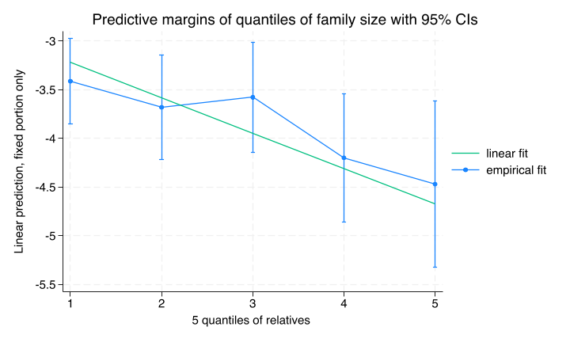
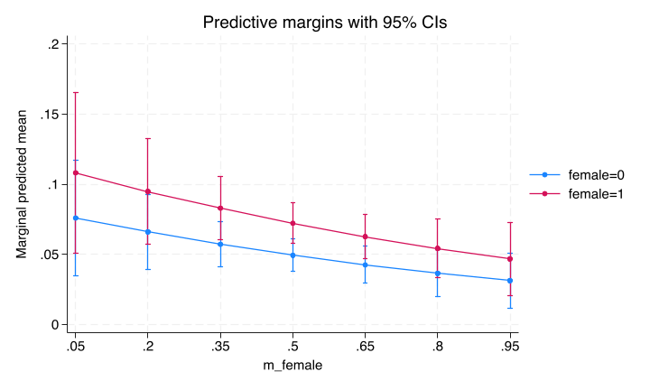
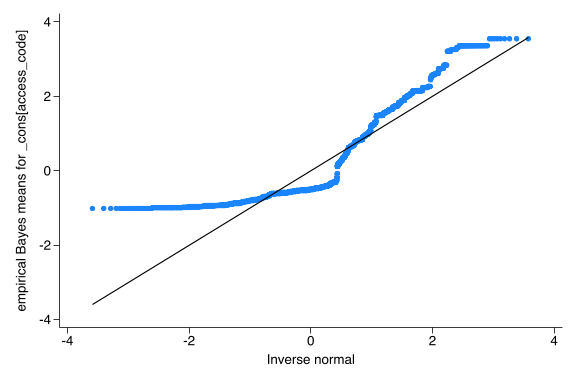
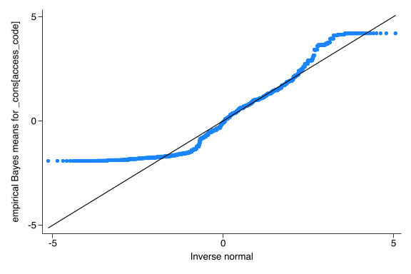

```{r}
#| include: false
stataexe <- "/Applications/StataNow/StataSE.app/Contents/MacOS/stata-se"
knitr::opts_chunk$set(engine.path=list(stata=stataexe))
library(Statamarkdown)
```


### Testing relative functional form

Family size is highly predictive of testing.  We checked the functional form by including a quadratic or a log term and then at the empirical fit on the log odds scale for quantiles of family size and compared it to the linear fit of 

::: {.callout-note collapse=true}
#### Regression output checking quadratic and log terms
```{stata}
*| eval: true
*| code-fold: true
run sub/load_data.do
run  sub/create_vars.do
qui {
xtile dec_rel=relatives ,nq(5)
replace c_relatives=c_relatives+2.6
gen lnrelative=ln(c_relatives)
melogit test i.costarm i.navarm c_relatives lnrelative i2scale_std ///
	female || access_code: , nolog eform
predict xb, xb
}

* lnrelative not significant
melogit test i.costarm i.navarm c_relatives lnrelative i2scale_std ///
	female || access_code: , nolog eform
* quadratic not significant
melogit test i.costarm i.navarm c.c_relatives##c.c_relatives i2scale_std ///
	female || access_code: , nolog eform

* compare linear to empirical fit
qui melogit test i.costarm i.navarm i.dec_rel i2scale_std ///
	female || access_code: , nolog eform
qui margins i.dec_rel,predict(xb)

marginsplot,addplot(lfit xb dec_rel, legend(order(3 "linear fit" ///
	2 "empirical fit" ))) ///
	title(Predictive margins of quantiles of family size with 95% CIs)
qui graph export img/fam_size_quantiles.png,replace
```
:::

#### Empirical fit vs linear fit on log odds scale



The linear fit seems like a reasonable functional form of the model

### Checking correlation of covariates and random effects

The model depends on independence of subject-level covariates and the random effects.  One way to check for this is to include the cluster-mean of a subject level covariate and test its significance.

::: {.callout-note collapse=true}
#### Regression output with cluster-mean of proportion female relatives included
```{stata}
*| eval: true
*| code-fold: true
run sub/load_data.do
run sub/create_vars.do
melogit test i.costarm i.navarm c_relatives i2scale_std ///
	female m_female || access_code: , nolog

* Table of results
qui {
collect clear
collect _r_b _r_ci: qui melogit,or
collect addtags rowheader["Interventions"], fortags(colname[i.costarm i.navarm])
collect addtags rowheader["Covariates"], ///
	fortags(colname[c_relatives i2scale_std female m_female])
collect layout (rowheader#colname) (result)
collect label levels result _r_b "Odds ratio" ,modify
collect label levels colname c_relatives "Larger family(per 5 relatives)" ///
	i2scale_std "Family communication (per s.d.)" ///
	female "Female relative" m_female "Family %female",modify
collect style showbase off
collect style cell, nformat(%5.2f)
collect style cell result[_r_ci], sformat("[%s]") cidelimiter(", ")
collect style cell result[_r_b], halign(center)
collect style cell border_block, border(right, pattern(nil))
collect title "Table: Testing cluster-level female mean "
collect export sub/table_test_m_female.md,replace
}

margins , at(m_female=(.05(.15).95) female=(0,1) c_relatives=0) 
marginsplot
graph export "img/female_and_m_female.png",replace 
```
:::

##### Odds ratios
```{r}
#| results: asis
#| echo: false
cat(readLines('sub/table_test_m_female.md'), sep = '\n')
```

The coefficient for the mean family proportion of female relatives was not significant which provides some evidence for the assumption of independence of subject-level covariates and the random effects.  However the point estimate is substantial  with a confidence interval largely below one.  However the point estimates of the intervention effects are reassuringly not affected by including this variable.

##### Graph of marginal probability of testing by relative sex as function of cluster family size

We can see the relationship of testing to mean family proportion of female relatives and individual female sex from this regression in the graph below on the probability scale averaging over the other coefficients and family size.

{.lightbox}

### Distribution of random effects for testing

Generalized multilevel models also make an assumption of normally distributed random effects.  

For testing, given the descriptive data showing substantial numbers of people with 0 testing we suspect the assumption is moderately violated.

```{stata}
*| eval: true
*| code-fold: true
run sub/load_data.do
run sub/create_vars.do
* Full model
qui melogit test i.costarm i.navarm c_relatives i2scale_std ///
	female || access_code: , eform
* Caterpillar graph
qui predict re_effect,reffects ebmeans reses(re_ses)
qnorm re_effect
qui graph export img/test_re_dist.png, replace
```




As expected there is departure from normality at the lower end of the random effects scale.  However, work by McCulloch (@McCulloch_2011_67_270) and Neuhaus (@Neuhaus_2012_32_2419) and echoed by Rabe-Hesketh & Skrondal (@Rabe-Hesketh_2022) suggest that these departures from normality have minimal effect on the fixed effects estimates or the covereage of the confidence intervals.  

### Distribution of random effects for invitation

We see a similar distribution for invitation.

```{stata}
*| eval: true
*| code-fold: true
run sub/load_data.do
run sub/create_vars.do
* Full model
qui melogit invite i.costarm i.navarm c_relatives i2scale_std ///
	female || access_code: , eform
* Caterpillar graph
qui predict re_effect,reffects ebmeans reses(re_ses)
qnorm re_effect
qui graph export img/invite_re_dist.png, replace
```


